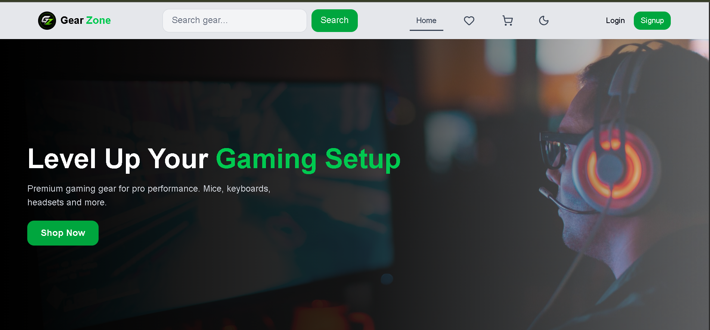
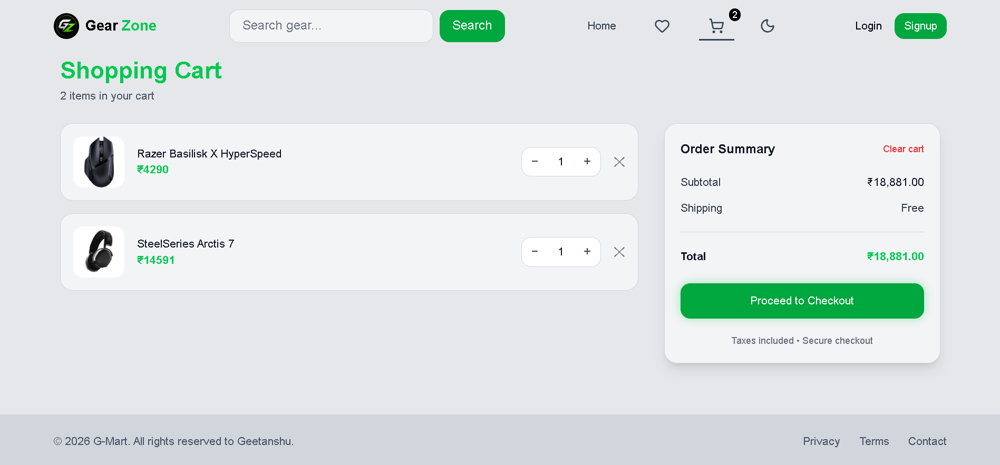

<p align="center">
  <a href="https://gaming-gear-shop.geetanshupatil2004.workers.dev/">
    
  </a>

  
  
  
  
</p>

# GearZone – Gaming Gear Ecommerce Store

A modern and responsive gaming gear ecommerce frontend built with **React, Redux Toolkit, Tailwind CSS, and React Router**.

Designed with a premium gaming-inspired UI, mobile-first responsiveness, dark/light theme support, advanced product search, cart & wishlist management, and smooth user experience.

---

# 📸 Screenshots

## 🏠 Home Page


## 🛒 Cart Page


---

# 🚀 Features

## 🛍️ Ecommerce Functionality

- Product listing page
- Product details page
- Add to cart
- Wishlist management
- Quantity controls
- Order summary
- Checkout flow
- Order success page

---

## 🔍 Advanced Search

- Debounced search
- Multi-keyword search

Search by:
- Title
- Description
- Brand
- Category

- Mobile dedicated search page

---

## 🎨 UI / UX

- Fully responsive design
- Mobile-first navigation
- Sliding hamburger menu
- Dark / Light theme toggle
- Sticky navbar
- Smooth hover animations
- Empty states
- Loading states
- Modern card layouts

---

## ⚡ State Management

- Redux Toolkit
- Async thunks
- Persistent cart & wishlist
- Theme persistence
- Optimized product caching

---

# 🛠️ Tech Stack

- React.js
- Redux Toolkit
- React Router DOM
- Tailwind CSS
- Vite
- Lucide React
- React Hot Toast

---

# 📱 Responsive Design

Optimized for:

- Mobile devices
- Tablets
- Desktop screens

---

# 🌗 Theme Support

- Dark Theme
- Light Theme
- Persistent theme preference

---

# 📂 Project Structure

```bash
src/
 ├── features/
 │    ├── auth/
 │    ├── cart/
 │    ├── products/
 │    ├── wishlist/
 │    └── theme/
 │
 ├── shared/
 │    └── components/
 │
 ├── hooks/
 │
 ├── pages/
 │
 └── app/
```

---

# ⚙️ Installation

## Clone the repository

```bash
git clone https://github.com/GeetanshuPatil/finale-gaming-gear-store
```

## Navigate to project folder

```bash
cd gearzone
```

## Install dependencies

```bash
npm install
```

## Start development server

```bash
npm run dev
```

---

# 🏗️ Build For Production

```bash
npm run build
```

## Preview production build

```bash
npm run preview
```

---

# 🌐 Live Demo

Add your deployed link here:

```txt
https://your-live-demo-link.com
```

---

# 📸 Screenshots

Add screenshots of:

- Homepage
- Product page
- Cart page
- Mobile view
- Dark mode

---

# ✨ Future Improvements

- Payment gateway integration
- Backend integration
- User profile section
- Product reviews
- Order tracking
- Admin dashboard
- Authentication with JWT

---

# 👨‍💻 Author

## Geetanshu Patil

- GitHub: https://github.com/GeetanshuPatil
- LinkedIn: https://www.linkedin.com/in/geetanshu-patil-923637375/
- Portfolio: https://portfolio-geet1.vercel.app/

---

# 📄 License

This project is for learning and portfolio purposes.